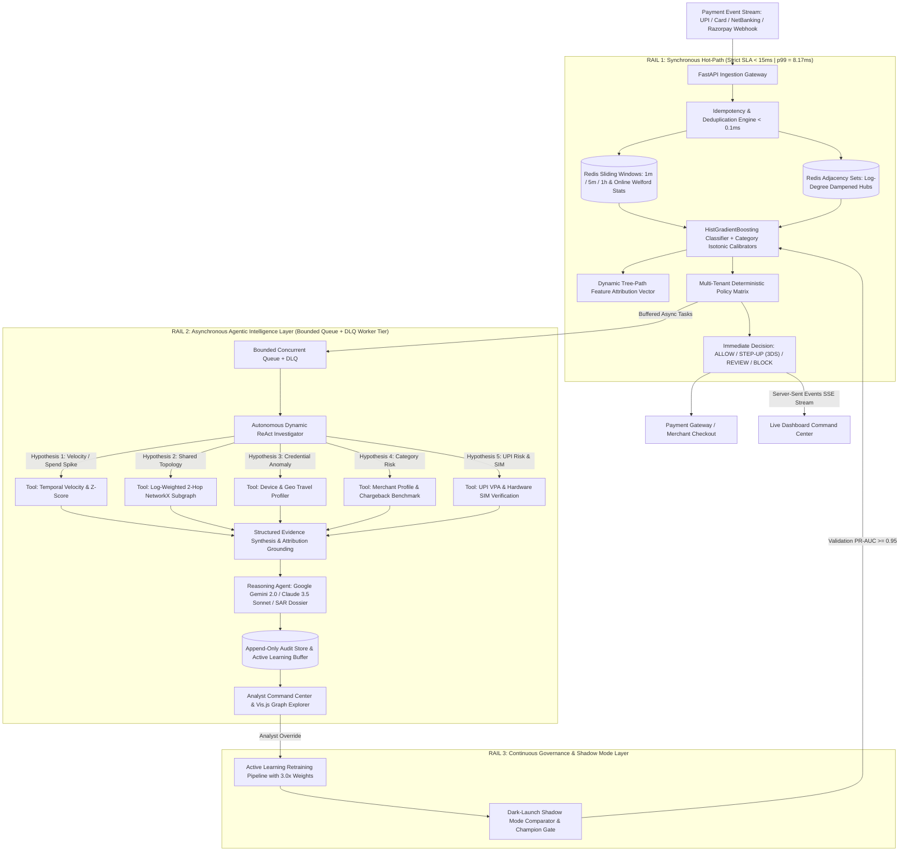

# System Architecture — Razorpay RiskIQ (Sentinel)

**Razorpay RiskIQ (Sentinel)** is an enterprise-grade autonomous payment risk & abuse-ring AI agent platform engineered to detect coordinated fraud syndicates, prevent account takeovers, and reduce false declines without adding checkout friction.

---

## 1. Triple-Rail Distributed Architecture

RiskIQ operates on an asynchronous **Triple-Rail Architecture** that strictly decouples the high-throughput payment checkout hot path ($SLA < 15\text{ms}$ | $p99 = 8.17\text{ms}$) from deep agentic investigation:

---

## 2. Component Specifications

### 2.1 Idempotency & Deduplication Engine (`streaming/idempotency.py`)
- **Deterministic Hashing**: SHA-256 fingerprinting of incoming transaction signatures (`customer_id + merchant_id + amount + minute_bucket`) or explicit `idempotency_key` headers.
- **Microsecond Caching**: Sub-$0.1\text{ms}$ replay resolution, preventing duplicate velocity explosions and false-positive fraud declines from network/webhook retries.

### 2.2 Online Streaming Feature Store (`streaming/feature_store.py`)
- **Primary Engine**: High-throughput Redis cluster utilizing atomic Sorted Sets (`ZADD`, `ZREMRANGEBYSCORE`, `ZCARD`) for rolling temporal velocities (1m, 5m, 1h) with TTL expiration.
- **UPI Deep Signals**: Real-time extraction of VPA handle risk, hardware SIM binding verification status, and Intent/QR payment modes.
- **Statistical Moments**: Online continuous mean and variance tracking via Welford's one-pass algorithm.
- **Failover**: Thread-safe in-memory cache with zero-latency failover if Redis is temporarily unreachable.

### 2.3 Hybrid Entity Graph Engine (`graph/entity_graph.py`)
- **Hot Path (Sub-2ms)**: Redis Adjacency Sets (`g:dev:{id}`, `g:ip:{id}`, `g:card:{id}`) for $O(1)$ degree centrality extraction.
- **Inverse Logarithmic Hub Dampening**: Edge weighting $W = 1 / \log_2(2 + k)$ for mega-hubs (public Wi-Fi, NAT gateways) to prevent false-positive ring explosion.
- **Deep Path**: Bounded NetworkX $k=2$ hop ego-graph traversal with community clustering and interactive Vis.js graph topology extraction.

### 2.4 Calibrated Machine Learning Pipeline (`scoring/`)
- **Model**: `HistGradientBoostingClassifier` trained on non-linear payment interactions (amount distributions, 1m/5m/1h velocities, device degrees, ring densities, geo deviations, UPI signals).
- **Multi-Tenant Isotonic Calibration**: Category-specific `IsotonicRegression` risk curves (`GAMING_CRYPTO`, `LUXURY_JEWELRY`, `ECOMMERCE_RETAIL`, `FOOD_GROCERY`, `UTILITY_BILLPAY`) reducing Brier calibration loss across all merchant segments.
- **Dynamic Tree-Path Explainability**: Real-time sample-level feature attribution vectors derived from tree importance and standardized feature deviations.

### 2.5 Autonomous Dynamic ReAct Agent (`agents/`)
- **Investigation Agent**: Dynamically formulates investigation hypotheses, prioritizes tool selection based on expected information gain, and terminates early once evidence reaches conclusive certainty ($>0.90$ or $<0.10$).
- **Reasoning Agent**: Converts multi-tool evidence into audit-proof executive briefs via Claude 3.5 Sonnet (with robust deterministic template fallback). Strictly non-hallucinatory and guaranteed to never mutate risk scores or decisions.
- **Decision Agent**: Multi-tenant policy matrix mapping probability scores, SHAP vectors, and ring topology to bounded actions: `ALLOW`, `STEP-UP AUTH` (Dynamic 3DS / OTP), `REVIEW`, and `BLOCK`.

### 2.6 Resilient Async Worker Pipeline & DLQ (`streaming/async_worker.py`)
- **Worker Tier**: Bounded threadpool execution decoupled from HTTP hotpath.
- **Dead Letter Queue (DLQ)**: Captures unrecoverable task errors with exponential backoff retry policies.
- **Shadow Mode Challenger**: Real-time dark-launch comparator scoring challenger models against live champion models without impacting checkout latency.

### 2.7 Automated Active Learning Retraining Pipeline (`scoring/retraining_pipeline.py`)
- **Analyst Overrides**: Captures human review corrections, tagging feature snapshots with $3.0\times$ sample weights in an active learning buffer.
- **Safe Promotion**: Automatically trains candidate challenger models, evaluates Brier score and PR-AUC on held-out test splits, and promotes challenger models to Champion.

### 2.8 Real-Time Streaming & Observability (`api/routes.py`, `dashboard/`)
- **Server-Sent Events (SSE)**: Real-time event streaming (`/api/stream/events`) broadcasting live payment flows directly to the UI.
- **Interactive Command Center**: Live attack injection simulator, Vis.js graph physics, TreeSHAP visualizer, and telemetry strip.
- **Offline Drift Benchmarking (`eval/`)**: Population Stability Index (PSI = 0.0092), Kolmogorov-Smirnov test, and high-concurrency load benchmark (p99 = 8.17ms).
