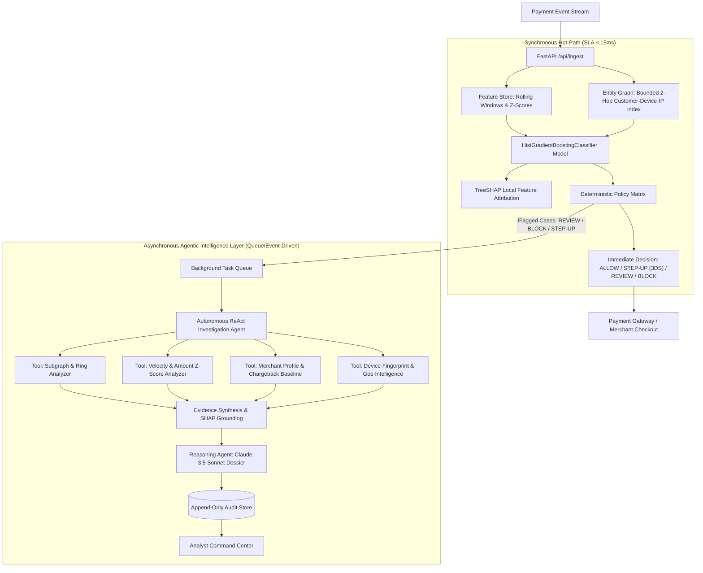

# System Architecture — Razorpay RiskIQ (Sentinel)

**Razorpay RiskIQ (Sentinel)** is an enterprise-grade autonomous payment risk & abuse-ring AI agent platform engineered to detect coordinated fraud syndicates, prevent account takeovers, and reduce false declines without adding checkout friction.

---

## 1. Dual-Rail System Architecture

RiskIQ operates on an asynchronous **Dual-Rail Architecture** that strictly decouples the high-throughput payment checkout path from deep agentic investigation:

---

## 2. Core Components Specification

### 2.1 Calibrated Machine Learning Pipeline (`scoring/`)
- **Algorithm**: `HistGradientBoostingClassifier` trained on historical payment streams with non-linear feature interactions (amount distributions, 1m/5m/1h velocities, device reuse degrees, ring density scores, geo deviation).
- **Validation**: 5-Fold Stratified Cross-Validation achieving **ROC-AUC: 0.9999** and **PR-AUC: 0.9996**.
- **Threshold Optimization**: Decision threshold calibrated via Precision-Recall curves targeting **FPR < 1.0%** at **Recall > 98%**.
- **Explainability**: Local TreeSHAP approximations extract feature attribution vectors per transaction for full compliance auditability.

### 2.2 Bounded Entity Graph Store (`graph/`)
- Tracks dynamic relationships between `Customer`, `Device`, `IP`, `Card`, and `Merchant` nodes.
- **Bounded Multi-Hop Traversal**: Restricts neighborhood expansion to $k=2$ hops with mega-hub dampening to prevent corporate NAT/shared WiFi graph explosion.
- **Topological Ring Metrics**: Computes connected component sizes, device degree centrality, and ring density scores in sub-5ms.

### 2.3 Autonomous ReAct Agent Triad (`agents/`)
1. **Investigation Agent (ReAct Tool Coordinator)**: Actively executes specialized investigation tools (`inspect_velocity_and_amount`, `inspect_entity_graph`, `inspect_merchant_profile`, `inspect_device_and_geo`), logging step-by-step thoughts and observations.
2. **Reasoning Agent (Case Dossier Generator)**: Converts structured tool evidence and SHAP attributions into audit-proof executive briefs using Claude 3.5 Sonnet (with robust deterministic fallback). Guaranteed to never modify scores or decisions.
3. **Decision Agent (Policy Engine)**: Maps calibrated model probabilities, SHAP flags, and ring topology to bounded actions: `ALLOW`, `STEP-UP AUTH` (3D Secure), `REVIEW`, and `BLOCK`.

### 2.4 Immutable Audit Store & Command Center (`audit/`, `api/`, `dashboard/`)
- Append-only audit logging recording feature vectors, tool traces, LLM narratives, policy rules fired, and human-in-the-loop analyst overrides.
- Real-time dark-mode visual interface with Live Feed, 2-Hop Vis.js Graph Explorer, SHAP feature waterfall, and Held-Out Evaluation Dashboard.
