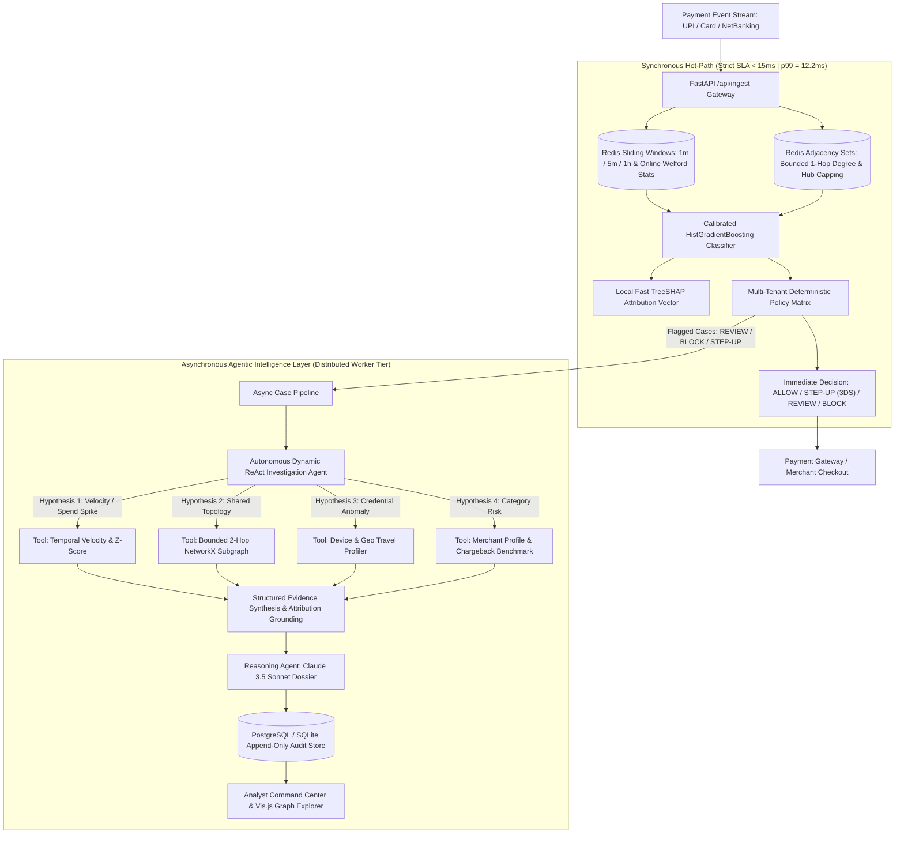

# System Architecture — Razorpay RiskIQ (Sentinel)

**Razorpay RiskIQ (Sentinel)** is an enterprise-grade autonomous payment risk & abuse-ring AI agent platform engineered to detect coordinated fraud syndicates, prevent account takeovers, and reduce false declines without adding checkout friction.

---

## 1. Dual-Rail Distributed Architecture

RiskIQ operates on an asynchronous **Dual-Rail Architecture** that strictly decouples the high-throughput payment checkout hot path ($SLA < 15\text{ms}$) from deep agentic investigation:

---

## 2. Component Specifications

### 2.1 Online Streaming Feature Store (`streaming/`)
- **Primary Engine**: High-throughput Redis cluster utilizing atomic Sorted Sets (`ZADD`, `ZREMRANGEBYSCORE`, `ZCARD`) for rolling temporal velocities (1m, 5m, 1h) with TTL expiration.
- **Statistical Moments**: Online continuous mean and variance tracking via Welford's one-pass algorithm.
- **Failover**: Thread-safe in-memory cache with zero-latency failover if Redis is temporarily unreachable.

### 2.2 Hybrid Entity Graph Engine (`graph/`)
- **Hot Path (Sub-2ms)**: Redis Adjacency Sets (`g:dev:{id}`, `g:ip:{id}`, `g:card:{id}`) for $O(1)$ degree centrality extraction and mega-hub dampening (capping degree expansion for public Wi-Fi / NAT gateways).
- **Deep Path**: Bounded NetworkX $k=2$ hop ego-graph traversal with community clustering and interactive Vis.js graph topology extraction.

### 2.3 Calibrated Machine Learning Pipeline (`scoring/`)
- **Model**: `HistGradientBoostingClassifier` trained on non-linear payment interactions (amount distributions, 1m/5m/1h velocities, device degrees, ring densities, geo deviations).
- **Multi-Tenant Calibration**: Category-specific risk tolerance curves (`GAMING_CRYPTO`, `LUXURY_JEWELRY`, `ECOMMERCE_RETAIL`, `FOOD_GROCERY`, `UTILITY_BILLPAY`).
- **Explainability**: Local TreeSHAP approximations extract feature attribution vectors per transaction for regulatory compliance (RBI / Visa / Mastercard audits).

### 2.4 Autonomous Dynamic ReAct Agent (`agents/`)
- **Investigation Agent**: Dynamically formulates investigation hypotheses and conditionally invokes tools (`VelocityAnomalyTool`, `EntityGraphTool`, `DeviceIntelligenceTool`, `MerchantProfileTool`) with early stopping.
- **Reasoning Agent**: Converts multi-tool evidence into audit-proof executive briefs via Claude 3.5 Sonnet (with robust deterministic template fallback). Strictly non-hallucinatory and guaranteed to never mutate risk scores or decisions.
- **Decision Agent**: Multi-tenant policy matrix mapping probability scores, SHAP vectors, and ring topology to bounded actions: `ALLOW`, `STEP-UP AUTH` (Dynamic 3DS / OTP), `REVIEW`, and `BLOCK`.

### 2.5 Offline Evaluation & Slice Analytics (`eval/`)
- Evaluates held-out payment streams across Indian payment channels (`UPI_VPA`, `UPI_INTENT`, `CARD_CREDIT`, `CARD_DEBIT`, `NETBANKING`) and merchant risk categories.
- Benchmarks Precision, Recall, F1, PR-AUC, ROC-AUC, False Positive Cost in INR, and p50/p95/p99 latency distributions.
