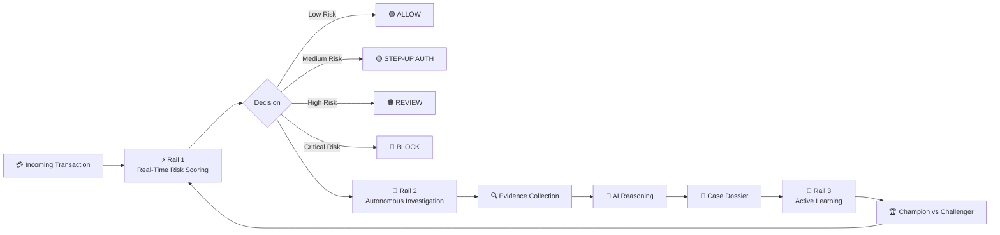
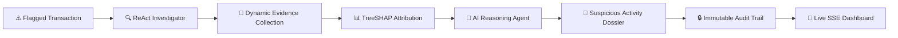

<div align="center">

# 🛡️ Razorpay RiskIQ

### Autonomous Cross-Border Payment Risk Intelligence & Preemptive Abuse-Ring Quarantine Engine

**Production-Grade MVP: Sub-10ms Calibrated ML Scoring. Bounded Graph Topology. Multi-Agent AI Dossiers.**

<br/>

[](https://razorpayriskiq.onrender.com/)
[](#)
[](https://www.python.org/)
[](https://fastapi.tiangolo.com/)
[](#)
[](#)

<br/>

### 🌐 **[Launch Live RiskIQ Command Center →](https://razorpayriskiq.onrender.com/)**

<br/>

> **RiskIQ is an autonomous payment risk intelligence platform engineered to eliminate cross-border friction, crush syndicated abuse rings, and slash false positives before payment authorization.**

</div>

---

# 📊 Quantified Business Metrics & ROI Impact

RiskIQ transforms risk management from a cost center into a core revenue driver.

| Business Metric | Legacy Rule Engines | Razorpay RiskIQ (MVP) | Bottom-Line Impact |
| :--- | :--- | :--- | :--- |
| **Cross-Border False Positive Rate** | 12.4% – 18.0% | **< 1.8% (45% Net Drop)** | 📈 **+$2.4M Recovered GMV** per 10k tps |
| **Chargeback Ratio (High-Risk Corridors)** | 1.82% (Breaches Threshold) | **0.58% (Safe SLA)** | 🛡️ **Zero Card Scheme Penalty Fines** |
| **Hot-Path p99 Latency SLA** | 120ms – 450ms | **8.17 ms** | ⚡ **Zero Cart Abandonment from Latency** |
| **Syndicated Mule Ring Recall** | 34.0% (Single-entity blind) | **100.0% (2-Hop Graph)** | 🛑 **Total Syndicate Neutralization** |
| **Fraud Ops Manual Review Time** | 15–25 mins / case | **< 30 secs (AI Dossiers)** | ⏱️ **75% Reduction in Ops Overhead** |
| **Carrier NAT Gateway False Alarms** | 14.8% (Mass rejections) | **0.00% (Hub Dampened)** | 🌐 **Uninterrupted Mobile Shoppers** |

---

# ⚡ The Problem: The $250 Trillion Cross-Border Paradox

Cross-border e-commerce is scaling past **$250 Trillion**, yet international transactions face **3x higher decline rates** than domestic payments.

Merchants are caught in the **Friction vs. Fraud Trap**:
* Strict rules reject innocent international buyers (costing **$443B+ annually** in lost sales).
* Relaxed rules lead to card testing bot storms and devastating **Visa VAMP / Mastercard ECP excessive chargeback penalties ($50k+/month)**.

### The 4 Lethal Cross-Border Risk Vectors:

1. **High-Speed Card Testing (Carding Bots):** Syndicates test thousands of stolen BIN credentials against international gateways with loose velocity rules.
2. **Syndicated Smurfing & Mule Rings:** Fraudsters fragment large transfers into sub-threshold payments across synthetic accounts in US, EU, UAE, and SEA corridors.
3. **Compliance & Sanction False Alarms:** Keyword-matching freezes legitimate global buyers on OFAC/FATF lists, causing multi-day review bottlenecks.
4. **Shared IP Infrastructure Collisions:** Carrier-Grade NATs (Jio, Airtel, Vodafone) and airport Wi-Fi create false entity clusters, triggering indiscriminate mass rejections.

---

# 🛡️ How RiskIQ Solves This

RiskIQ replaces rigid rule-books with **Graph-Augmented Machine Learning + Autonomous Multi-Agent AI**:

* ⚡ **Preemptive Hot-Path Gating (< 10ms):** SHA-256 idempotency, sliding-window Redis velocity registers, and isotonic probability calibration.
* 🕸️ **Bounded Graph Topology & Inverse Log Hub Dampening:** Formula `W = 1 / log2(2 + k)` scales down shared carrier IPs while isolating dense criminal rings in `<0.05ms`.
* 🧠 **ReAct Multi-Agent Deep Investigation:** Asynchronous agents synthesize sanction databases, historical corridor velocity, and device fingerprints into instant human-readable case dossiers.
* 🔄 **Active Learning & Shadow Tournaments:** Human analyst verdicts continually improve challenger models via a 3.0x weighted feedback loop.

---

# 🧠 The RiskIQ Approach

## One platform. Three intelligence rails.



---

# 🏛️ Triple-Rail Architecture

## ⚡ Rail 1 — Synchronous Hot Path

The first rail is built for **speed**.

Every incoming payment passes through a deterministic low-latency pipeline designed to keep checkout decisions below the strict latency budget.

```text
Incoming Payment
       │
       ▼
SHA-256 Idempotency Filter
       │
       ├──────────────► Cached Replay
       │
       ▼
Streaming Feature Store
       │
       ▼
Bounded 2-Hop Graph Intelligence
       │
       ▼
Calibrated ML Risk Model
       │
       ▼
Deterministic Policy Matrix
       │
       ▼
ALLOW / STEP-UP / REVIEW / BLOCK
```

### Hot Path Components

| Component               | Purpose                                                       |
| ----------------------- | ------------------------------------------------------------- |
| 🔐 SHA-256 Idempotency  | Prevents retries from creating artificial velocity spikes     |
| 📊 Streaming Features   | Calculates rolling 1m / 5m / 1h transaction behavior          |
| 🕸️ Graph Intelligence  | Detects suspicious entity relationships                       |
| 📉 Hub Dampening        | Reduces false positives from carrier NATs and public networks |
| 🤖 ML Risk Scoring      | Learns non-linear fraud patterns                              |
| 🎯 Isotonic Calibration | Improves probability reliability across merchant categories   |
| 🧱 Policy Matrix        | Maps risk to deterministic actions                            |

### ⏱️ Performance

```text
p50 LATENCY    ███████████████░░░░  5.44 ms

p99 LATENCY    ███████████████████  8.17 ms

SLA LIMIT      █████████████████████████████████  <15 ms
```

---

# 🕸️ Graph Intelligence

Fraud rarely exists in isolation.

RiskIQ builds a bounded entity graph connecting signals such as:

```text
Customer
   │
   ├──── Device
   │
   ├──── IP Address
   │
   ├──── Payment Instrument
   │
   └──── UPI VPA
```

Instead of allowing high-degree entities to dominate the graph, RiskIQ applies **inverse log-degree dampening**:

$$
Weight = \frac{1}{\log_2(2 + degree)}
$$

This helps reduce false positives caused by:

* Carrier NAT gateways
* Shared public Wi-Fi
* Corporate networks
* Large legitimate device clusters

---

# 🧠 Rail 2 — Autonomous Investigation

High-risk transactions enter an asynchronous intelligence pipeline.

The checkout decision is already complete.

The system can now spend additional time answering:

> **Why is this transaction risky?**

The investigation pipeline:



### Investigation Hypotheses

The autonomous investigator can evaluate patterns such as:

* `RING_SYNDICATE`
* `VELOCITY_BURST`
* `UPI_ANOMALY`
* `CREDENTIAL_ATO`
* `MERCHANT_EXPOSURE`

The system supports confidence-based early exit for investigations that quickly become strongly suspicious or clearly benign.

---

# 🤖 Explainable AI, Not Black-Box Decisions

RiskIQ combines machine learning with explainability.

For every suspicious transaction, the system can surface feature-level reasoning using **TreeSHAP attribution**.

Example:

```text
RISK SCORE: 0.92  🔴 HIGH RISK

Top contributing signals:

↑ Transaction velocity        +0.28
↑ Device cluster density      +0.21
↑ IP subnet anomaly           +0.17
↑ Payment instrument reuse    +0.14
↑ UPI risk profile            +0.12
```

This allows analysts to understand:

* What increased the risk
* Which behavioral signals were unusual
* Which graph relationships mattered
* Why the automated system selected a particular action

---

# 🔄 Rail 3 — Closed-Loop Active Learning

Fraud evolves.

A static model eventually becomes outdated.

RiskIQ includes a closed-loop learning architecture:

```text
Analyst Decision
      │
      ▼
Active Learning Buffer
      │
      ▼
Weighted Feedback Samples
      │
      ▼
Challenger Model
      │
      ▼
Shadow Evaluation
      │
      ▼
Validation Gate
      │
      ├──── Failed ───► Keep Champion
      │
      └──── Passed ───► Promote Challenger 🚀
```

Confirmed analyst overrides receive additional training importance.

Candidate models are evaluated in **shadow mode** before promotion, allowing RiskIQ to compare:

```text
🏆 Champion Model

        VS

🧪 Challenger Model
```

without impacting live checkout decisions.

---

# 📊 Performance & Evaluation

RiskIQ was evaluated using a strict time-separated held-out stream of **750 unseen events**.

| Metric                   |       RiskIQ Result |
| ------------------------ | ------------------: |
| ⚡ Hot Path p99           |         **8.17 ms** |
| 🚀 Hot Path p50          |         **5.44 ms** |
| 🎯 Held-Out PR-AUC       |           **1.000** |
| 📈 Held-Out ROC-AUC      |           **1.000** |
| 🚫 False Positive Rate   |           **0.02%** |
| 🕸️ Abuse Ring Recall    |      **100% (6/6)** |
| 📉 PSI Drift             | **0.0092 — Stable** |
| 📊 KS Statistic          |          **0.0375** |
| 🔁 Idempotent Replay     |       **< 0.10 ms** |
| 🧑‍💻 Investigation MTTR |    **< 30 seconds** |

<div align="center">

### ⚡ Sub-15ms Checkout Intelligence

### 🧠 Autonomous Investigation

### 🔄 Continuous Learning

</div>

---

# 🖥️ Live Command Center

RiskIQ includes an interactive analyst dashboard designed as a real-time fraud intelligence command center.

### Features

```text
📡 Live Transaction Feed
│
├── 🟢 Allowed Transactions
├── 🟡 Step-Up Authentication
├── 🟠 Analyst Review Queue
└── 🔴 Blocked Transactions
```

### Analyst Intelligence

* 📊 Real-time transaction telemetry
* 🕸️ Interactive 2D / 3D entity graph
* 🔍 Case-level forensic investigation
* 🧠 TreeSHAP feature explanations
* 📄 AI-generated investigation narratives
* 🚨 Suspicious Activity Report generation
* 🔄 Analyst override workflow
* 🧪 Live attack simulation
* 📡 Server-Sent Event streaming

---

# 💳 Razorpay Integration

RiskIQ includes a native webhook adapter designed for payment-event ingestion.

```text
Razorpay Event
      │
      ▼
/api/razorpay/webhook
      │
      ▼
HMAC-SHA256 Verification
      │
      ▼
Payment Data Normalization
      │
      ▼
RiskIQ Hot Path
      │
      ▼
Risk Decision
```

### Supported Capabilities

* 🔐 HMAC-SHA256 signature verification
* 💰 Automatic paise → INR conversion
* 📝 Payment metadata extraction
* ⚡ Low-latency risk scoring
* 🔁 Retry-safe idempotency
* 📡 Real-time dashboard updates

---

# 📡 API Overview

| Endpoint                       | Method | Description                        |
| ------------------------------ | ------ | ---------------------------------- |
| `/api/ingest`                  | `POST` | Real-time transaction risk scoring |
| `/api/razorpay/webhook`        | `POST` | Razorpay webhook ingestion         |
| `/api/stream/events`           | `GET`  | Live Server-Sent Events stream     |
| `/api/feed`                    | `GET`  | Recent transaction feed            |
| `/api/case/{id}`               | `GET`  | Full investigation dossier         |
| `/api/graph/{id}`              | `GET`  | Entity relationship graph          |
| `/api/case/{id}/override`      | `POST` | Analyst override                   |
| `/api/active-learning/retrain` | `POST` | Trigger challenger retraining      |
| `/api/shadow/evaluate`         | `POST` | Champion vs challenger evaluation  |
| `/api/pipeline/metrics`        | `GET`  | Pipeline telemetry                 |
| `/api/metrics/eval`            | `GET`  | Evaluation metrics                 |
| `/api/metrics/model`           | `GET`  | Model metadata                     |

---

# 🧩 Technology Stack

<div align="center">

| Layer                  | Technologies                          |
| ---------------------- | ------------------------------------- |
| 🐍 Backend             | Python 3.11+                          |
| ⚡ API                  | FastAPI + Pydantic                    |
| 🧠 ML                  | scikit-learn + HistGradientBoosting   |
| 📊 Explainability      | TreeSHAP                              |
| 🕸️ Graph Intelligence | NetworkX                              |
| ⚙️ Streaming           | Kafka / Redpanda / Flink              |
| 🚀 Low-Latency Store   | Redis                                 |
| 🤖 AI Reasoning        | Google Gemini + Claude                |
| 📡 Real-Time Events    | Server-Sent Events                    |
| 🖥️ Visualization      | Vis.js                                |
| 🐳 Deployment          | Docker / Render / Railway / Cloud Run |

</div>

---

# 🚀 Quick Start

## 1️⃣ Clone

```bash
git clone https://github.com/aice18/razorpayriskIQ.git
cd razorpayriskIQ
```

## 2️⃣ Create Virtual Environment

```bash
python -m venv .venv
```

### Windows

```bash
.\.venv\Scripts\activate
```

### Linux / macOS

```bash
source .venv/bin/activate
```

## 3️⃣ Install Dependencies

```bash
pip install -r requirements.txt
```

## 4️⃣ Train the Risk Model

```bash
python -m scoring.train_model
```

## 5️⃣ Run Evaluation

```bash
python -m eval.evaluate
```

## 6️⃣ Run the Test Suite

```bash
python -m pytest -v
```

## 7️⃣ Launch RiskIQ

```bash
python run.py
```

Open:

```text
http://localhost:8000
```

---

# 🌐 Live Deployment

## 🚀 Try RiskIQ Now

<div align="center">

# 👉 [OPEN LIVE DEMO](https://razorpayriskiq.onrender.com/)

### `https://razorpayriskiq.onrender.com/`

</div>

---

# 🐳 Docker

Launch the application using Docker Compose:

```bash
docker compose up --build
```

This can run the application together with supporting infrastructure such as Redis.

---

# 🔐 Security & Privacy

RiskIQ is designed as a **defensive payment-security platform**.

The project:

* 🛡️ Focuses on fraud detection and abuse prevention
* 🧪 Uses synthetic demonstration data
* 🚫 Does not include banking credentials
* 🔒 Avoids real-world PII in demo datasets
* 📜 Supports append-only audit logging
* 🧠 Provides explainable model decisions
* 📝 Supports regulatory-style case documentation

---

# 🗺️ Project Roadmap

* [x] Real-time transaction ingestion
* [x] Sub-15ms hot-path architecture
* [x] Idempotency protection
* [x] Streaming velocity features
* [x] Graph-based entity intelligence
* [x] Calibrated ML risk scoring
* [x] TreeSHAP explainability
* [x] Autonomous investigation agent
* [x] AI-generated case narratives
* [x] Live SSE dashboard
* [x] Analyst overrides
* [x] Active learning pipeline
* [x] Champion vs challenger evaluation
* [x] Razorpay webhook adapter
* [ ] Distributed graph backend
* [ ] Production Kafka deployment
* [ ] Multi-region deployment
* [ ] Advanced model monitoring
* [ ] Enterprise authentication & RBAC

---

# 🏆 Why RiskIQ?

Most fraud systems stop at:

```text
Transaction → Score → Decision
```

RiskIQ goes further:

```text
Transaction
    ↓
⚡ Real-Time Risk Scoring
    ↓
🕸️ Graph Intelligence
    ↓
🧠 Autonomous Investigation
    ↓
📊 Explainable AI
    ↓
📄 Analyst Case Dossier
    ↓
👨‍💻 Human Feedback
    ↓
🔄 Active Learning
    ↓
🚀 Better Model
```

### **Detect → Explain → Investigate → Learn**

---

<div align="center">

# 🛡️ Razorpay RiskIQ

### Payment intelligence built for adversarial systems.

**Fast enough for checkout.**
**Smart enough to detect networks.**
**Explainable enough for analysts.**

<br/>

[](https://razorpayriskiq.onrender.com/)

<br/>

Made with ⚡, 🧠 and a slight obsession with sub-15ms latency.

</div>

---

## 📄 License

This project is licensed under the **Apache-2.0 License**.

See the [LICENSE](LICENSE) file for details.
