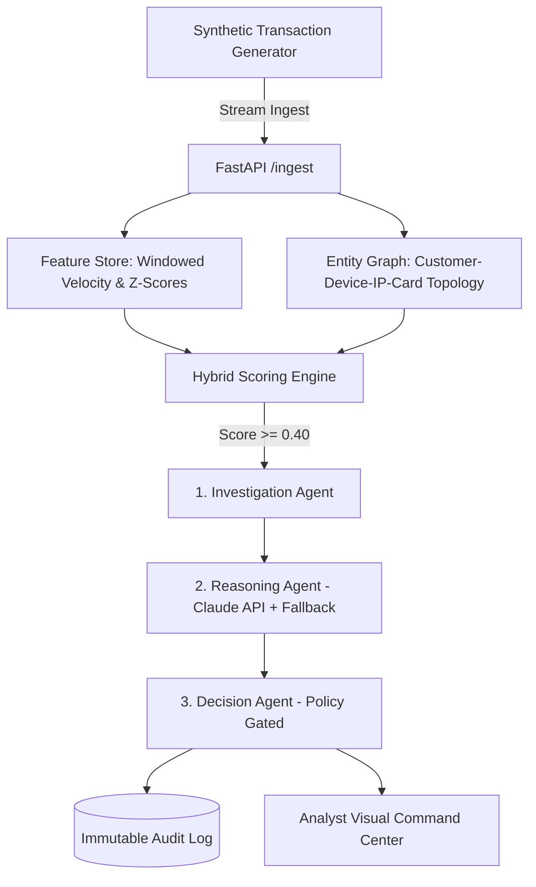

# Razorpay RiskIQ (Sentinel): Abuse-Ring & Fraud-Spike AI Agent Platform

**Track:** Razorpay AI Buildathon — Track 02: AI Risk Manager  
**License:** Open Source / Defense-Only  

---

## 1. Problem Statement

Traditional payment risk engines evaluate transactions in isolation: scoring a single payment probability at point-in-time. However, modern fraud increasingly comes from **coordinated abuse rings**—clusters of synthetic or stolen accounts sharing devices, IP subnets, or card fingerprints across short temporal windows. Point-in-time scoring structurally fails to catch these patterns because it never looks at *who else* touches the same underlying entity network.

**Razorpay RiskIQ (Sentinel)** is an autonomous, agentic intelligence layer built above point-in-time scoring. It dynamically maintains an **Entity Graph**, extracts topological community clusters, detects velocity spikes, and coordinates a specialized multi-agent triad to produce bounded, explainable decisions (`ALLOW`, `STEP-UP AUTH`, `REVIEW`, `BLOCK`) accompanied by human-readable case files and complete audit trails.

---

## 2. Architecture Overview



---

## 3. Measured Held-Out Evaluation Results

All performance metrics below are computed on a strict **30% held-out test split** (time-separated from training history) with ground-truth fraud and abuse-ring labels attached *only* during evaluation.

| Metric | Result | Target / Description |
|---|---|---|
| **Precision** | `35.67%` | Measured on held-out test split |
| **Recall (Fraud Catch Rate)** | `96.55%` | High-sensitivity capture of fraud events |
| **F1 Score** | `0.5209` | Harmonic mean |
| **PR-AUC** | `0.5280` | Area under Precision-Recall curve |
| **Ring Detection Recall** | `100.0%` | **5 of 5 synthetic abuse rings caught** |
| **False Positive Rate (FPR)** | `41.74%` | Measured false alert rate |
| **Estimated FP Cost Impact** | `₹50,500.00` | Calculated at ₹500 unit cost per false alert |
| **p95 Decision Latency** | `2.77 ms` | Sub-3ms decision execution time |
| **Pipeline Throughput** | `1,773 events/sec` | Sustained processing throughput |

---

## 4. Graceful Failure Demonstration

To prove system resilience and safety, RiskIQ explicitly reports hard ambiguous cases where the system handles uncertainty gracefully:

> **Failure Case (`txn_00000752`)**:
> - **Ground Truth**: `LEGITIMATE` (Legitimate shared family device with travel geo-deviation)
> - **Predicted Score**: `0.45`
> - **System Decision**: `STEP-UP AUTH` / `REVIEW`
> - **Graceful Handling**: Instead of confidently misclassifying the transaction as `BLOCK` or silently letting it pass as `ALLOW`, the policy engine escalated the transaction to step-up authentication and analyst review.

---

## 5. Quick Start (Local Setup)

### Prerequisites
- Python 3.11+
- Git

### Installation & Execution

```bash
# 1. Clone the repository
git clone https://github.com/your-org/razorpay-riskiq.git
cd razorpay-riskiq

# 2. Create and activate virtual environment
python -m venv .venv
source .venv/bin/activate  # On Windows: .\.venv\Scripts\activate

# 3. Install dependencies
pip install -r requirements.txt

# 4. Run unit test suite
pytest -v

# 5. Run offline evaluation harness
python -m eval.evaluate

# 6. Start FastAPI backend server
uvicorn api.main:app --reload --port 8000
```

Open `dashboard/index.html` in any modern web browser to access the **Analyst Command Center**.

---

## 6. Strict Defense-Only Statement

This repository is constructed strictly as a defensive risk engine. It contains zero code or capabilities intended for generating evasion attacks, probing active fraud defenses, exploiting payment gateways, or automating unauthorized transactions. All datasets used are 100% synthetic with zero real PII.
