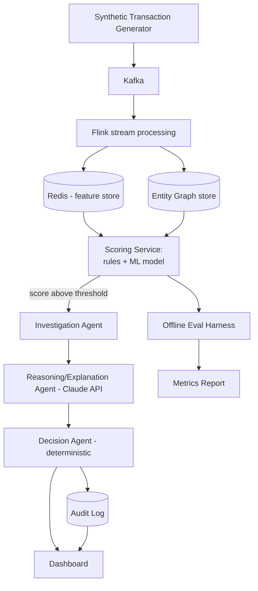

# TRD — Sentinel: Technical Requirements Document

## 1. Architecture Overview

Reuses the existing KavachX real-time pipeline and adds a graph layer and an agent layer on top.

## 2. Components

| Component | Responsibility | Notes |
|---|---|---|
| Generator | Emits synthetic transactions in real time; injects normal traffic, fraud rings, velocity spikes; writes ground-truth labels to a separate held-out store | Python, configurable rates |
| Kafka | Transport for the transaction stream | Reuse KavachX topic conventions |
| Flink | Windowed feature computation (velocity, spend deviation), writes to Redis and updates the graph | Reuse KavachX jobs where possible |
| Redis | Low-latency feature store (rolling counts, recent history per entity) | |
| Entity Graph | Nodes: customer, device, IP, card, merchant. Edges: "used_by", "linked_to". Supports connected-component / community detection queries | NetworkX for simplicity, or Neo4j if time allows |
| Scoring Service | Combines graph features + velocity/ML features into a single risk score via a simple, interpretable model (logistic regression / gradient boosting) | Deterministic, versioned, testable in isolation |
| Investigation Agent | Assembles a structured evidence package (graph neighbors, feature values, ring membership) for any case above threshold | Pure Python, no LLM |
| Reasoning/Explanation Agent | Calls Claude API with the structured evidence to produce a plain-language case narrative | LLM used for language generation only — never scores or decides |
| Decision Agent | Maps score bands to ALLOW / STEP-UP AUTH / REVIEW / BLOCK via fixed, documented thresholds | Deterministic and unit-testable |
| Audit Log | Immutable record per case: evidence, score, narrative, decision, timestamp | Append-only store (flat file or SQLite is fine for a demo) |
| Dashboard | Live feed, graph explorer, case detail, metrics view | Reuse KavachX dashboard shell |
| Eval Harness | Runs the full pipeline against the held-out labeled set, computes metrics | Offline batch job, run before submission and recorded in EVAL_PLAN results |

## 3. Data Flow (per transaction)

1. Generator emits transaction → Kafka.
2. Flink computes windowed features (velocity, deviation from merchant/customer baseline) → Redis.
3. Flink updates entity graph edges for this transaction's device/IP/card/customer/merchant.
4. Scoring Service pulls features + graph metrics → risk score.
5. If score < threshold: transaction logged as ALLOW, no agent invocation (cost/latency control).
6. If score ≥ threshold: Investigation Agent builds evidence package → Reasoning Agent narrates → Decision Agent assigns final action → Audit Log write → Dashboard update.

## 4. Non-Functional Requirements

- **Latency:** feature computation + scoring should stay well under 500ms per transaction; full agent path (only for flagged cases) under 2s p95.
- **Throughput:** demo target 50–200 events/sec sustained from the generator — enough to show real-time behavior without needing production-scale infra.
- **Determinism:** given the same evidence, the Decision Agent must always produce the same action. LLM output (narrative) may vary in wording but must never change the decision.
- **Auditability:** every flagged case must have a complete, retrievable evidence trail.
- **Data safety:** synthetic data only; no real PII anywhere in the repo, logs, or demo.

## 5. Tech Stack

| Layer | Choice | Why |
|---|---|---|
| Streaming | Kafka + Flink | Reuse KavachX, proven, real-time story for the demo |
| Feature store | Redis | Reuse KavachX, low-latency lookups |
| Graph | NetworkX (fallback), Neo4j (stretch) | NetworkX is fastest to stand up solo in 2–3 weeks |
| Scoring model | scikit-learn (logistic regression / gradient boosting) | Simple, interpretable, fast to evaluate honestly |
| Agent orchestration | Plain Python + Claude API (Anthropic SDK) | No need for a heavy agent framework at this scale; keeps the pipeline auditable |
| API | FastAPI | Fast to build, good for exposing the dashboard and eval endpoints |
| Dashboard | Reuse KavachX (React or whatever it's built in) | Don't rebuild what already works |
| Audit log | SQLite or append-only JSONL | Simple, inspectable, good enough for a demo scale |

## 6. Security / Compliance Notes

- Explicit "Defense-only" statement in README and a short section in the code (e.g., a `SECURITY.md`) describing what the system deliberately does NOT do (no evasion testing, no adversarial generation tooling shipped).
- No real customer data at any point.
- Claude API calls should not receive any real PII — only synthetic entity IDs and feature values.
