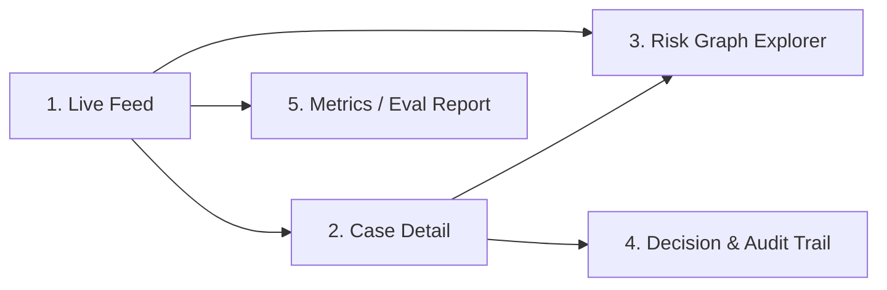

# Screen Flow — Sentinel Dashboard

## User flow narrative

An analyst opens the dashboard and sees the live transaction feed. Most transactions scroll by as ALLOW. When a transaction crosses the risk threshold, it surfaces as a flagged case in a priority queue. The analyst clicks into it, sees the graph of related entities and the plain-language investigation narrative, sees the system's proposed decision and *why*, and can accept or override it. The override and the reasoning behind it get logged. Separately, a metrics screen shows how the whole system is performing against the held-out set — this is the screen that matters most for the buildathon submission itself.

## Screens

### 1. Live Feed
- Real-time scrolling list of transactions as they're scored (ALLOW shown minimally, flagged cases pinned to top in a priority queue).
- Each row: transaction ID, amount, risk score, status badge, timestamp.
- Purpose: show the system is genuinely real-time, not a static demo.

### 2. Case Detail
- Header: transaction summary (amount, merchant, customer, device, IP, card — synthetic IDs).
- Evidence panel: the specific anomalies detected (e.g., "17x normal transaction value," "new device," "3 other accounts share this device in the last 24h").
- Narrative panel: the Reasoning Agent's plain-language case summary.
- Purpose: this is where "explainable, not just a probability" gets proven.

### 3. Risk Graph Explorer
- Interactive graph view centered on the case's entities (customer, device, IP, card, merchant as nodes).
- Highlights the connected component / ring if one exists, with size and other members shown.
- Purpose: visually prove the ring-detection capability — this is the most senior, most differentiated piece of the build, so it should look good.

### 4. Decision & Audit Trail
- Shows the Decision Agent's output (ALLOW / STEP-UP AUTH / REVIEW / BLOCK) with the exact threshold/rule that fired.
- Analyst can accept or override, with a required reason if overriding.
- Full timestamped log of evidence → narrative → decision → (optional) override.
- Purpose: this is the audit trail the buildathon bar explicitly asks for.

### 5. Metrics / Eval Report
- Precision, recall, F1, PR-AUC, false-positive rate, false-positive cost estimate, on the held-out set.
- One example failure case shown explicitly, with what happened and how it was handled (e.g., escalated to review, not silently wrong).
- Purpose: this screen is effectively the scoring rubric made visible — treat it as important as the live demo.

## Notes for build priority

If time runs short in Week 3, screens 1, 2, and 5 are the must-haves. The Graph Explorer (3) is the differentiator but can degrade to a static graph image in the worst case. The audit trail (4) can be a simple table rather than a polished UI — the data being real and complete matters more than the UI being pretty.
